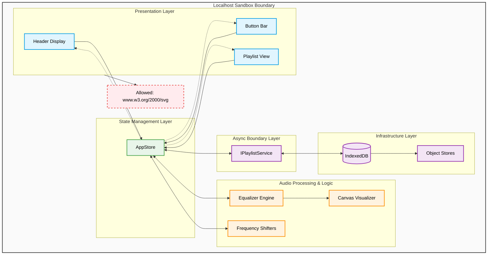

# Project architecture

[↑ Go back to README.md](../../README.md)

- [→ Architecture](./architecture.md) specifies what the system is composed of and how parts interact (the "blueprint").
- [→ Design](./design.md) bridges the gap, detailing how specific components are structured internally.
- [→ Implementation](./implementation.md) is the execution of these designs, where the abstract models are translated into functional code.

## Audience

The primary audience will be FireFox **mobile** browser add-on users.

## Product

A local media player shows a playlist of Audio/Video files stored in **IndexedDB**. 
Included is a 10 band **equalizer** with 3 **frequency shifters** and audio visualization on **canvas**.

Product focus is on mobile devices. The product is useful also on small screens.

## Language and framework

Vanilla **TypeScript** project using **Vite framework** (vanilla-ts template) with **Playwright** for E2E and integration testing.

## Global Standards

- Mobile first
- [PEP 20 – The Zen of Python](https://peps.python.org/pep-0020/)

## Project Standards

- The project uses the English language.
- Business arguments are on top of any discussion.
- Advocate project changes to the Product Owner (PO), me. Consider time, cost and a clean project.
- Design decisions focus is on making the future transition to Angular as painless as possible.

## Code writing Standards

- Functional programming. Break the standard if needed and explain the use case.
- Doc-strings are mandatory for all modules
- Update README.md in the module folder if major changes where made to a module.
- "LTeX+" and "Code Spell Checker" "vscode" add-ons, so we can enjoy our work.
- Use "sentencechecker.com/" to be sure your sentence is valid English at all.
- **camelCase** syntax for JS variable names and **BEM (Block Element Modifier)** for DOM names.
- Add elements dynamic to DOM. Means document.createelement('div') approach
- The project uses **pre-commit hooks** for linting and formatting.
- No optimization without discussion

## Architecture Overview Diagram

## Directory and layout

Core and service module are located under `/src/frontend/`. 
The `/src/frontend/layout/` directory is a mirror of the **component layout tree**.

The `/tests/src/frontend/` mirrors `/src/frontend/`.

**Layout tree** and **key directories** are depicted in the [→ design document](./design.md).

## Documentation

A README.md must be present in each of the subdirectories (components) if a major change was made. 
Use Markdown language and organize it in small informational blocks.

## Security

- Check the project folders in `/src/` for internet URLs and report the caller.
- Only allowed in **[SVG icons](www.w3.org/2000/svg)**.
- No test ever may call an internet URL.
- No network calls outside **localhost**.
- Sanitize div.innerHtml when needed.

## Architectural Design Decisions

The predecessor project was a bit messy. CommonJS has only a single global namespace. 
Changes to the core component code led also to multiple updates of UI code.

We use ESM modules and break down the project into smaller tasks using a Work Breakdown Structure (WBS).

### UI Layout development

- **Mandatory:** Header Display, Button Bar, Playlist View.
- The UI is available as **vector graphic** [→ Inkscape vector graphic](./docu_ui_layout_02.svg).

### Prototype

- **Prototype is non-functional** with layout mocks.
- **"Responsive Design Mode"** perfect fits all available devices
- **"Rotate viewport"** (landscape) leads to the collapse of the header on small displays, showing only button bar and playlist
- **System Hardware** light/dark-mode change leads to UI response

### MVP - Minimum Viable Product

- **Decoupled Architecture:** View layers (BEM elements) do not directly mutate data or trigger sibling logic. They exclusively emit intent payloads to the centralized `AppStore`.
- **Async Boundary Layer:** All asynchronous actions targeting IndexedDB are completely separated via `IPlaylistService` interfaces to guarantee pure code testability without infrastructure footprints.
- **Future-Proofing for Angular:** The application implements a centralized single-source-of-truth runtime cache mechanism that creates an exact functional parallel to an Angular RxJS stream topology.

### Alpha release

- **First User feedback:** Upload as FireFox test section add-on.
- **Negative feedback:** We like the most and must be answered quick and polite.
- **Improve the product:** Use feedback.

### Stable release

- All core functionality of the "Playlist Booster" project is implemented
- The 10 band Equalizer has only simple preset buttons (10 sliders don't fit on mobiles)

### Second release

- Visualizer "butterchurn" (Winamp milkdrop clone) NPM package is implemented
- A Five band equalizer UI menu for mobile user is added, with at least one custom preset save option

### Database

- Single Database (AudioDeityDB) containing multiple Object Stores (which act like tables in relational databases).

## Git tag history

- Git tags are used to mark major development milestones.
